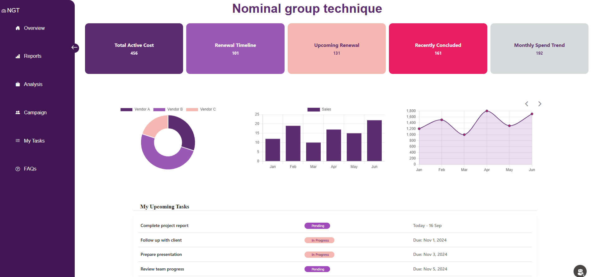

# Nominal-Group-Technique
## Vendor Management & Analytics Dashboard

This project is a modern web-based Vendor Management and Analytics Dashboard designed to help organizations track vendor activities, subscription costs, renewals, and departmental spending through an intuitive interface.

### Key Features

- **Overview Dashboard**
- 
  - Displays key metrics such as Total Active Cost, Renewal Timeline, Upcoming Renewals, Recently Concluded items, and Monthly Spend Trends.
  - Includes donut charts, bar graphs, and line charts for quick insights.

- **Analysis Module**
  - Filter vendors by name and activity status
  - Activity counts (Completed, Pending, Overdue)
  - Subscription amount breakdown by vendor
  - Department-wise spend trends (HR, IT, Finance)

- **Vendor Management**
  - Vendor listing with account manager email, subscription amount, and activity status
  - Add and edit vendor information

- **Task Tracking**
  - Track upcoming and pending tasks with due dates

- **User Interface**
  - Clean, responsive layout with sidebar navigation
  - Easy access to Overview, Reports, Analysis, Campaign, and Tasks

### Purpose

This system helps finance, procurement, and operations teams manage vendor subscriptions, monitor renewals, and analyze spending trends efficiently.

